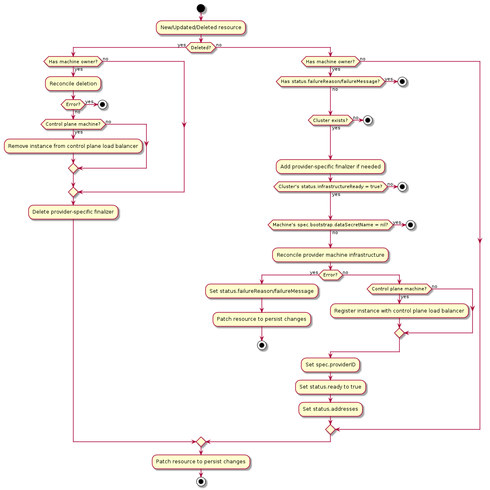

# Machine Infrastructure Provider Specification

## Overview

A machine infrastructure provider is responsible for managing the lifecycle of provider-specific machine instances.
These may be physical or virtual instances, and they represent the infrastructure for Kubernetes nodes.

## Data Types

A machine infrastructure provider must define an API type for "infrastructure machine" resources. The type:

1. Must belong to an API group served by the Kubernetes apiserver
2. May be implemented as a CustomResourceDefinition, or as part of an aggregated apiserver
3. Must be namespace-scoped
4. Must have the standard Kubernetes "type metadata" and "object metadata"
5. Must have a `spec` field with the following:
    1. Required fields:
        1. `providerID` (string): the identifier for the provider's machine instance
6. Must have a `status` field with the following:
    1. Required fields:
        1. `ready` (boolean): indicates the provider-specific infrastructure has been provisioned and is ready
    2. Optional fields:
        1. `failureReason` (string): indicates there is a fatal problem reconciling the provider's infrastructure;
            meant to be suitable for programmatic interpretation
        2. `failureMessage` (string): indicates there is a fatal problem reconciling the provider's infrastructure;
            meant to be a more descriptive value than `failureReason`
        3. `addresses` (`MachineAddress`): a list of the host names, external IP addresses, internal IP addresses,
            external DNS names, and/or internal DNS names for the provider's machine instance. `MachineAddress` is
            defined as:
                - `type` (string): one of `Hostname`, `ExternalIP`, `InternalIP`, `ExternalDNS`, `InternalDNS`
                - `address` (string)

## Behavior

A machine infrastructure provider must respond to changes to its "infrastructure machine" resources. This process is
typically called reconciliation. The provider must watch for new, updated, and deleted resources and respond
accordingly.

The following diagram shows the typical logic for a machine infrastructure provider:



### Normal resource

1. If the resource does not have a `Machine` owner, exit the reconciliation
    1. The Cluster API `Machine` reconciler populates this based on the value in the `Machines`'s
       `spec.infrastructureRef` field
1. If the resource has `status.failureReason` or `status.failureMessage` set, exit the reconciliation
1. If the `Cluster` to which this resource belongs cannot be found, exit the reconciliation
1. Add the provider-specific finalizer, if needed
1. If the associated `Cluster`'s `status.infrastructureReady` is `false`, exit the reconciliation
1. If the associated `Machine`'s `spec.bootstrap.dataSecretName` is `nil`, exit the reconciliation
1. Reconcile provider-specific machine infrastructure
    1. If any errors are encountered:
        1. If they are terminal failures, set `status.failureReason` and `status.failureMessage`
        1. Exit the reconciliation
    1. If this is a control plane machine, register the instance with the provider's control plane load balancer
       (optional)
1. Set `spec.providerID` to the provider-specific identifier for the provider's machine instance
1. Set `status.ready` to `true`
1. Set `status.addresses` to the provider-specific set of instance addresses (optional) 
1. Patch the resource to persist changes

### Deleted resource

1. If the resource has a `Machine` owner
    1. Perform deletion of provider-specific machine infrastructure
    1. If this is a control plane machine, deregister the instance from the provider's control plane load balancer
       (optional)
    1. If any errors are encountered, exit the reconciliation
1. Remove the provider-specific finalizer from the resource
1. Patch the resource to persist changes

## RBAC

### Provider controller

A machine infrastructure provider must have RBAC permissions for the types it defines. If you are using `kubebuilder` to
generate new API types, these permissions should be configured for you automatically. For example, the AWS provider has
the following configuration for its `AWSMachine` type:

```
// +kubebuilder:rbac:groups=infrastructure.cluster.x-k8s.io,resources=awsmachines,verbs=get;list;watch;create;update;patch;delete
// +kubebuilder:rbac:groups=infrastructure.cluster.x-k8s.io,resources=awsmachines/status,verbs=get;update;patch
```

A machine infrastructure provider may also need RBAC permissions for other types, such as `Cluster` and `Machine`. If
you need read-only access, you can limit the permissions to `get`, `list`, and `watch`. You can use the following
configuration for retrieving `Cluster` and `Machine` resources:

```
// +kubebuilder:rbac:groups=cluster.x-k8s.io,resources=clusters;clusters/status,verbs=get;list;watch
// +kubebuilder:rbac:groups=cluster.x-k8s.io,resources=machines;machines/status,verbs=get;list;watch
```

### Cluster API controllers

The Cluster API controller for `Machine` resources is configured with full read/write RBAC
permissions for all resources in the `infrastructure.cluster.x-k8s.io` API group. This group
represents all machine infrastructure providers for SIG Cluster Lifecycle-sponsored provider
subprojects. If you are writing a provider not sponsored by the SIG, you must grant full read/write
RBAC permissions for the "infrastructure machine" resource in your API group to the Cluster API
manager's `ServiceAccount`. `ClusterRoles` can be granted using the [aggregation label]
`cluster.x-k8s.io/aggregate-to-manager: "true"`. The following is an example `ClusterRole` for a
`FooMachine` resource:

```yaml
apiVersion: rbac.authorization.k8s.io/v1
kind: ClusterRole
metadata:
  name: capi-foo-machines
  labels:
    cluster.x-k8s.io/aggregate-to-manager: "true"
rules:
- apiGroups:
  - infrastructure.foo.com
  resources:
  - foomachines
  verbs:
  - create
  - delete
  - get
  - list
  - patch
  - update
  - watch
```

Note, the write permissions allow the `Machine` controller to set owner references and labels on the
"infrastructure machine" resources; they are not used for general mutations of these resources.

[aggregation label]: https://kubernetes.io/docs/reference/access-authn-authz/rbac/#aggregated-clusterroles
